<!DOCTYP html>
<html>

<head>
<link rel="shortcut icon" type="image/x-icom" href="05/003.PNG">
<title>KINO.TJ</title>
<meta charset="UTF-8">
<link rel="stylesheet" type="text/css" href="css/style.css" media="all">

     
	   
         
		 
</head>

<body>

     
	  

   <figure>  </figure>
      <figure>  </figure>
	     <figure>  </figure>
		    <figure>  </figure>
			   <figure>  </figure>

 
 

                  
 

 

 <aside>
      <a href="index.html">Равзанаи аввал</a>
	     <a href="#">Суроға</a>
		    <a href="#">Рақами телефон</a>
			   <a href="#">Руйхати рақамҳо</a>
			     </aside>
				 

    

                  
  
 
				  
 <h4>
				  <a href="#">Видеоуроки дарсӣ</a> 

	                <a href="#">Мультфильмы</a>  

				      <a href="#">Барномаҳои компютерӣ</a>   

					    <a href="#">Бозиҳо</a> 

					      	                        <a href="#">Библиотека</a>  

						      <a href="#">Коллекции</a>  

							     <a href="#">Шаблоны</a> 

								   <a href="#">Галерея</a> 

									  <a href="#">Самые ожидаемые</a>
				                 
 
								 
		
  
 <h3> Популярные новости 
 

        <h2>Гений или сумашедший?
            Преступник или жертва?
 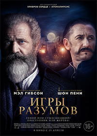

		<h2>  Фантастические твари:
          Преступления Грин-де-Вальда 
		  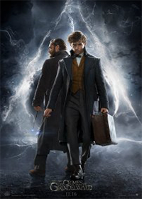

		    Фильм Человек муравей
			        (2015) 
		  смотреть онлайн в hd бесплатно
		  

		  Веном/Venom(2018)
		  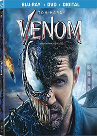

		  Человек-паук: Возвращение домой
		  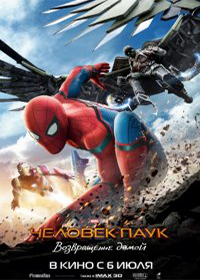

		  Ralf-protiv-interneta-2018
		   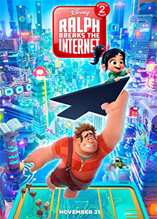

		    СУПЕРСЕМЕЙКА
			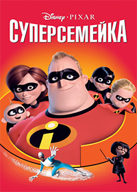

			 Sleduushee.pokolenie.(2018)
			 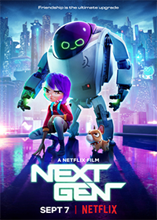

		
 
		   			     
	 
 
				             
				      
  
 
 
                      
  
<b>Аквамен / Aquaman (2018) </b> 
  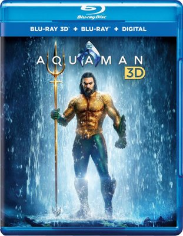
   
 <h4> <b>Информация о фильме</b>  Название:Аквамен Оригинальное название: Aquaman Год выпуска: 2018  Жанр: Фантастика, фэнтези, боевик, приключения   Режиссер: Джеймс Ван   В ролях: Джейсон Момоа, Эмбер Хёрд, Дольф Лундгрен, Николь Кидман, Джули Эндрюс, Патрик Уилсон, Уиллем Дефо, Грэм МакТавиш, Талия Джейд, Джимон Хонсу 
  

   <a href="index-2.html">Подробное</a>
 

					  
					  
  
<b>Монстр Траки / Monstr Traki (2017) </b> 
  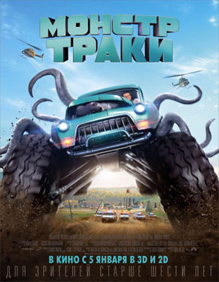
   
 <h4> <b>Информация о фильме</b>  Название:Монстр Траки  Оригинальное название: Monstr Traki Год выпуска: 2017   Жанр: Фантастика, приключения, боевик
  
 
  <a href="index-3.html">Подробное </a> 
  
 
					  
					  
  
<b>Человек-Паук / Spider Man (2017) </b> 
  
   
 <h4> <b>Информация о фильме</b>  Название:Человек-Паук  Оригинальное название: Spider Man Год выпуска: 2017   Жанр: боевик, приключения, Фантастика
  
 
 <a href="index-4.html"> Подробное </a>
  
 
					 
					   
  
<b>Фантастические Твари / Fantastic Beasts (2018) </b> 
  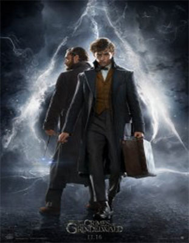
   
 <h4> <b>Информация о фильме</b>  Название:Фантастические твари:
Преступления Грин-де-Вальда  Оригинальное название: Fantastic Beasts: The Crimes of
Grindelwald Год выпуска: 2018   Жанр: Фантастика, приключения
  
 
 <a href="index-5.html">  Подробное </a>
  
  

 
 
  
<b>Человек Муравей / ANT-MAN (2015) </b> 
  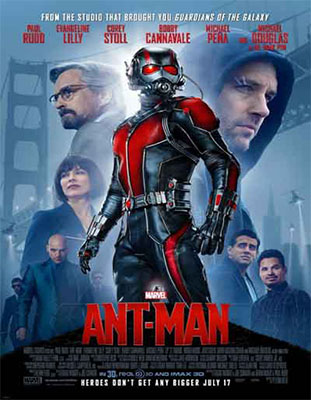
   
 <h4> <b>Информация о фильме</b>  Название:Человек Муравей  Оригинальное название: ANT-MAN Год выпуска: 2015   Жанр: Боевик, Фантастика
  
 
 <a href="index-6.html"> Подробное </a>
  
 
  
                     
  
<b>Стражи Галактики / Strazhi Galaktiki (2014) </b> 
  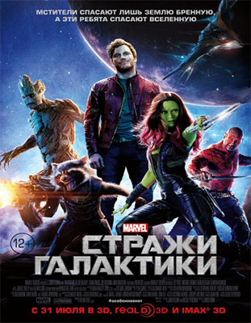
   
 <h4> <b>Информация о фильме</b>  Название:Стражи Галактики  Оригинальное название: Strazhi Galaktiki Год выпуска: 2014   Жанр: боевик, приключения, Фантастика
  
 
 <a href="index-7.html"> Подробное</a> 
  
 
                     
					 
					                   
								          
  
 <a href="index.html"> 1</a>   <a href="index - 1-1.html"> 2 </a> 
 

					 
	 
					   

				   
				       
						     
							   
					  
					 
				
				  
</body>

</html>
